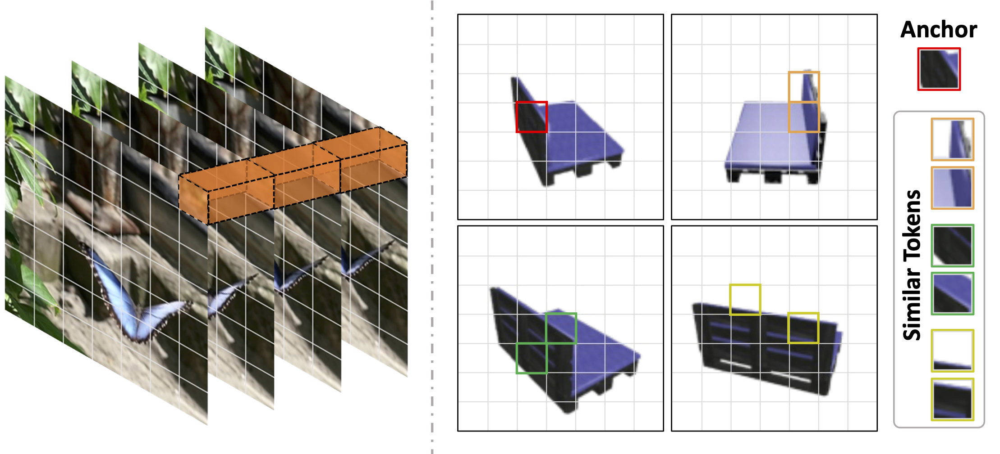
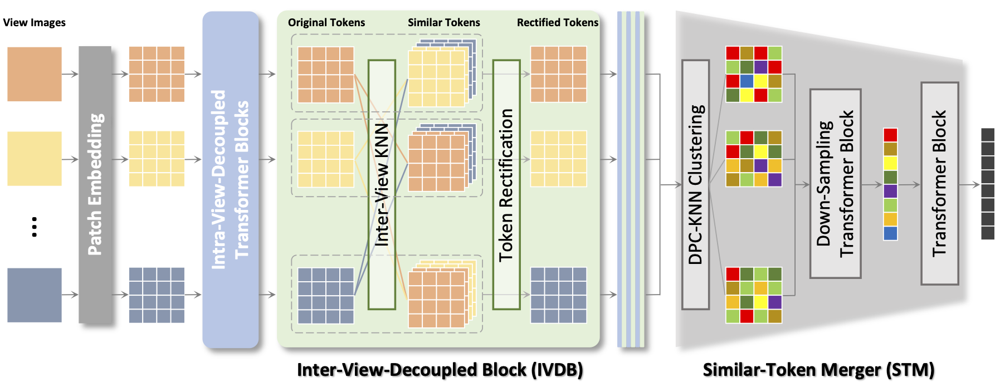

# UMIFormer

This repository contains the source code for the paper [UMIFormer: Mining the Correlations between Similar Tokens for Multi-View 3D Reconstruction](https://arxiv.org/abs/2302.13987).






## Performance

| Methods                                                                                                                                | 1 view          | 2 views         | 3 views         | 4 views         | 5 views         | 8 views         | 12 views        | 16 views        | 20 views        |
|----------------------------------------------------------------------------------------------------------------------------------------|-----------------|-----------------|-----------------|-----------------|-----------------|-----------------|-----------------|-----------------|-----------------|
| [3D-R2N2](https://github.com/chrischoy/3D-R2N2)                                                                                        | 0.560 / 0.351   | 0.603 / 0.368   | 0.617 / 0.372   | 0.625 / 0.378   | 0.634 / 0.382   | 0.635 / 0.383   | 0.636 / 0.382   | 0.636 / 0.382   | 0.636 / 0.383   |
| [AttSets](https://github.com/Yang7879/AttSets)                                                                                         | 0.642 / 0.395   | 0.662 / 0.418   | 0.670 / 0.426   | 0.675 / 0.430   | 0.677 / 0.432   | 0.685 / 0.444   | 0.688 / 0.445   | 0.692 / 0.447   | 0.693 / 0.448   |
| [Pix2Vox++](https://github.com/hzxie/Pix2Vox)                                                                                          | 0.670 / 0.436   | 0.695 / 0.452   | 0.704 / 0.455   | 0.708 / 0.457   | 0.711 / 0.458   | 0.715 / 0.459   | 0.717 / 0.460   | 0.718 / 0.461   | 0.719 / 0.462   |
| [GARNet](https://github.com/GaryZhu1996/GARNet)                                                                                        | 0.673 / 0.418   | 0.705 / 0.455   | 0.716 / 0.468   | 0.722 / 0.475   | 0.726 / 0.479   | 0.731 / 0.486   | 0.734 / 0.489   | 0.736 / 0.491   | 0.737 / 0.492   |
| [GARNet+](https://github.com/GaryZhu1996/GARNet)                                                                                       | 0.655 / 0.399   | 0.696 / 0.446   | 0.712 / 0.465   | 0.719 / 0.475   | 0.725 / 0.481   | 0.733 / 0.491   | 0.737 / 0.498   | 0.740 / 0.501   | 0.742 / 0.504   |
| [EVolT](https://openaccess.thecvf.com/content/ICCV2021/papers/Wang_Multi-View_3D_Reconstruction_With_Transformers_ICCV_2021_paper.pdf) | - / -           | - / -           | - / -           | 0.609 / 0.358   | - / -           | 0.698 / 0.448   | 0.720 / 0.475   | 0.729 / 0.486   | 0.735 / 0.492   |
| [LegoFormer](https://github.com/faridyagubbayli/LegoFormer)                                                                            | 0.519 / 0.282   | 0.644 / 0.392   | 0.679 / 0.428   | 0.694 / 0.444   | 0.703 / 0.453   | 0.713 / 0.464   | 0.717 / 0.470   | 0.719 / 0.472   | 0.721 / 0.472   |
| [3D-C2FT](https://github.com/bluestyle97/awesome-3d-reconstruction-papers)                                                             | 0.629 / 0.371   | 0.678 / 0.424   | 0.695 / 0.443   | 0.702 / 0.452   | 0.702 / 0.458   | 0.716 / 0.468   | 0.720 / 0.475   | 0.723 / 0.477   | 0.724 / 0.479   |
| [3D-RETR <br> <font size=2>(3 view)</font>](https://github.com/fomalhautb/3D-RETR)                                                     | 0.674 / -       | 0.707 / -       | 0.716 / -       | 0.720 / -       | 0.723 / -       | 0.727 / -       | 0.729 / -       | 0.730 / -       | 0.731 / -       |
| [3D-RETR*](https://github.com/fomalhautb/3D-RETR)                                                                                      | 0.680 / -       | 0.701 / -       | 0.716 / -       | 0.725 / -       | 0.736 / -       | 0.739 / -       | 0.747 / -       | 0.755 / -       | 0.757 / -       |
| UMIFormer                                                                                                                              | 0.6802 / 0.4281 | 0.7384 / 0.4919 | 0.7518 / 0.5067 | 0.7573 / 0.5127 | 0.7612 / 0.5168 | 0.7661 / 0.5213 | 0.7682 / 0.5232 | 0.7696 / 0.5245 | 0.7702 / 0.5251 |
| UMIFormer+                                                                                                                             | 0.5672 / 0.3177 | 0.7115 / 0.4568 | 0.7447 / 0.4947 | 0.7588 / 0.5104 | 0.7681 / 0.5216 | 0.7790 / 0.5348 | 0.7843 / 0.5415 | 0.7873 / 0.5451 | 0.7886 / 0.5466 |

###### * The results in this row are derived from models that train individually for the various number of input views.

## Demo


## Cite this work

```BibTex
@article{zhu2023umiformer,
  title={UMIFormer: Mining the Correlations between Similar Tokens for Multi-View 3D Reconstruction},
  author={Zhu, Zhenwei and Yang, Liying and Li, Ning and Jiang, Chaohao and Liang, Yanyan},
  journal={arXiv preprint arXiv:2302.13987},
  year={2023}
}
```

## Datasets

We use the [ShapeNet](https://www.shapenet.org/) in our experiments, which are available below:

- ShapeNet rendering images: http://cvgl.stanford.edu/data2/ShapeNetRendering.tgz
- ShapeNet voxelized models: http://cvgl.stanford.edu/data2/ShapeNetVox32.tgz

## Pretrained Models

The pretrained models on ShapeNet are available as follows:

- [UMIFormer](https://drive.google.com/file/d/1kgqhxsm-H3MCCjYz5Ur1Hlmt6onYCn_g/view?usp=share_link)
- [UMIFormer+](https://drive.google.com/file/d/1bg97EPC5KDkRxtgasNhhK5wk1TZGrU1P/view?usp=share_link)

Please download them and put into `./pths/`

## Prerequisites

#### Clone the Code Repository

```
git clone https://github.com/GaryZhu1996/UMIFormer
```

#### Install Python Dependencies

```
cd UMIFormer
conda env create -f environment.yml
```

#### Modify the path of datasets

Modify `__C.DATASETS.SHAPENET.RENDERING_PATH` and `__C.DATASETS.SHAPENET.VOXEL_PATH` in `config.py` to the correct path of ShapeNet dataset. 


## 3D Reconstruction Model

For training, please use the following command:

```
CUDA_VISIBLE_DEVICES=gpu_ids python -m torch.distributed.launch --nproc_per_node=num_of_gpu runner.py
```

For testing, please follow the steps below:

1. Update the setting of `__C.CONST.WEIGHTS` in `config.py` as the path of the reconstruction model;
2. Run the following command to evaluate the performance of the model when facing the number of input views defined by __C.CONST.N_VIEWS_RENDERING in config.py:
```
CUDA_VISIBLE_DEVICES=gpu_ids python -m torch.distributed.launch --nproc_per_node=num_of_gpu runner.py --test
```
3. Run the following command to evaluate the performance of the model when facing various numbers of input views mentioned in the paper:
```
CUDA_VISIBLE_DEVICES=gpu_ids python -m torch.distributed.launch --nproc_per_node=num_of_gpu runner.py --batch_test
```


## Our Other Works on Multi-View 3D Reconstruction

```BibTex
@article{zhu2023garnet,
  title={GARNet: Global-Aware Multi-View 3D Reconstruction Network and the Cost-Performance Tradeoff},
  author={Zhu, Zhenwei and Yang, Liying and Lin, Xuxin and Yang, Lin and Liang, Yanyan},
  journal={Pattern Recognition},
  pages={109674},
  year={2023},
  publisher={Elsevier}
}
```
```BibTex
@article{yang2023longrange,
  title={Long-Range Grouping Transformer for Multi-View 3D Reconstruction}, 
  author={Yang, Liying and Zhu, Zhenwei and Lin, Xuxin and Nong, Jian and Liang, Yanyan},
  journal={arXiv preprint arXiv:2308.08724},
  year={2023}
}
```


## License

This project is open sourced under MIT license.
